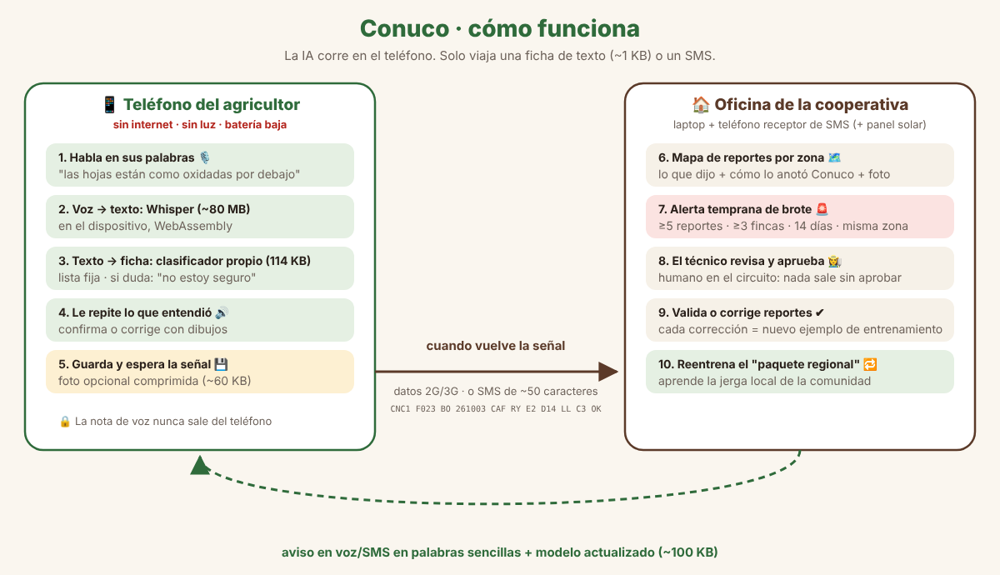

# 🌱 Conuco — a voice field notebook that works without internet or electricity

**Hack-Nation 7th Global AI Hackathon · World Bank "Small AI for Development" · Track B: Agriculture**

🔗 **Live demo:** https://oryamx.github.io/conuco/ (farmer app) · https://oryamx.github.io/conuco/cooperativa.html (cooperative panel)

> *Conuco* is the Venezuelan word for a small family farm plot.

## The problem
In Venezuela's Andean coffee region, farmers live with daily blackouts (≈98% of households in the Andes report daily outages — Infobae, Sep 2026), weak or no mobile signal, and an extension officer who visits twice a year at best. Yields sit at 4–8 quintals/ha versus 25–30 possible (Fedeagro).

When a pest or disease starts, the farmer sees it first — but has no one to tell, no technical vocabulary to describe it, and **no record exists of what is happening in the field**. By the time a technician hears about it, it has spread across the valley. The World Bank brief names this gap directly: *"the binding constraint is the absence of a working farmer registry rather than the absence of an algorithm."*

## The solution
Everyone builds AI that **talks to** farmers. Conuco is AI that **listens to** them — and turns what they already know into data a technician can act on.

1. The farmer **speaks in their own words**: *"las hojas están como oxidadas por debajo y se están cayendo"* ("the leaves look rusty underneath and are falling").
2. **On the phone, offline**, Whisper transcribes the voice note and a tiny classifier we trained turns it into a **technical field record** (crop, compatible symptom, plant part, extent, since when, weather).
3. Conuco **reads back what it understood, out loud**. The farmer confirms, or corrects by tapping a picture.
4. The record is stored on the phone and **sent automatically when signal returns** — or as a ~50-character SMS.
5. The cooperative sees a **map** and gets an **early outbreak alert** when several farms in one area report the same thing.
6. A **technician or cooperative promoter reviews and approves** the alert, which goes back to every farm in the area in plain language (voice/SMS).

Conuco **does not diagnose or prescribe**. It records what the person sees and tells a person. When it is not sure, it says so.

## Two crops, two tiny model packs
| Pack | Why | Categories (fixed list + "not sure") | Model size |
|---|---|---|---|
| ☕ Coffee | The World Bank brief's scenario; Venezuela's Andean smallholders | rust, berry borer, leaf miner, American leaf spot, brown eye spot, dieback, chewing insects (leaf-cutter ants), nutrition | ~130 KB |
| 🌽 Maize | The most critical crop for food security in Venezuela; grown on almost every *conuco* | fall armyworm, root pests (white grubs / Diabrotica), damaged ears, stored-grain weevil, drought stress, nutrition, leaf spots | ~105 KB |

The farmer picks what they grow when they register; if they name a crop in the sentence ("el maíz…"), Conuco switches pack automatically. Adding a crop = adding training phrases and running `python3 modelo/entrenar.py --cultivo <crop>`. Maize categories are deliberately conservative ("compatible with…, needs technician review").

## Why AI (and why a simpler tool would not do the job)
An SMS form needs literacy and technical vocabulary. A farmer can say *"los bachacos dejaron las matas peladitas"*; only speech recognition + language understanding can turn that into *"chewing-insect damage (leaf-cutter ants)"* — and do it offline, on a phone that is charged a few hours a day.

## Results with a real Venezuelan speaker (voice, on-device)
Gabi (team, Venezuelan) spoke 9 test phrases out loud into the live app. The phrases were written by the team and were **not** used for training.

| Outcome | Count |
|---|---|
| Correct category | **8 / 9** |
| Wrong category with high confidence | **0** |
| "Not sure → ask a person" | 1 (speech recognition heard *"Dios"* instead of *"cogollos"*; the app refused to guess) |

**First real test, first failure, first lesson:** the very first thing Gabi said was *"las hojas están como comidas"* (leaves look eaten). The model had no category for chewing-insect damage, so it answered **"not sure"** instead of inventing. We added the category, retrained, and it now understands it. That is exactly how Conuco is meant to learn the language of each community.

⚠️ Honest limits: all test phrases were written by the team, not by farmers; this measures the voice pipeline and phrasing variations, not real farmer vocabulary.

## Who uses it and who runs it
| Role | Tool | What they do |
|---|---|---|
| Farmer | Phone app (offline) | Speaks, confirms, optionally adds a photo, reports |
| Technician / cooperative promoter | Panel (`cooperativa.html`) | Reviews, validates or corrects reports; approves alerts |
| Regional coordinator (cooperative / federation) | `modelo/entrenar.py` | Retrains the regional model pack with validated phrases and publishes it |

The cooperative owns its data. Minimum infrastructure: a laptop or mini-PC at the office and an old Android phone as an SMS receiver (optional: small solar panel). Hosting cost is near zero because **all AI runs on the phone**; the website is only needed to install the app once (it can also be side-loaded from the promoter's laptop).

## Architecture (everything runs in the browser)
| Piece | Technology | Where it runs |
|---|---|---|
| Voice → text | Whisper base/tiny (q8 quantized, ~80 / ~40 MB) via transformers.js + ONNX WebAssembly, in a Web Worker | Phone, offline |
| Text → field record | **Our own classifiers**, one per crop: character n-gram TF-IDF + logistic regression, **~130 KB coffee / ~105 KB maize** (`modelo_conuco.json`, `modelo_maiz.json`), fixed list of categories, confidence thresholds (≥70% sure, 45–70% "check", <45% "not sure → ask a person"); `lexicon.js` extracts plant part, extent, timing and weather and explains which words it recognized | Phone, offline |
| Speech recognition fixes | Small list of common mis-hearings of farm words (e.g. *"más ron"* → *"marrón"*), grows with real corrections | Phone |
| Read-back | Web Speech API (system voice) | Phone, offline |
| Photo (optional) | Compressed to 640 px JPEG (~40–80 KB) as **evidence for the technician** — not diagnosed by AI | Phone → cooperative |
| Offline app | Service Worker + Cache Storage | Phone |
| Delayed sending | Local queue (store-and-forward) + SMS code | Phone |
| Panel & alerts | Leaflet map + outbreak rule (≥5 reports, ≥3 farms, 14 days, same area and symptom) | Cooperative office |

In this prototype the "cooperative" is the panel on the same site (shared browser storage). In production, sending would go to the cooperative's server or an SMS gateway — not built yet.

## Conuco learns from use (how it adapts to other regions and slang)
1. The farmer corrects by tapping a picture, or the technician validates/corrects the report in the panel.
2. The panel counts validated phrases and lets you download them (`frases_validadas.txt`).
3. `python3 modelo/entrenar.py --entrenar-con frases_validadas.txt` retrains the model with the area's real vocabulary.
4. The new model (~130 KB) is pushed to phones when there is signal.

A model pack per region or language is ~130 KB — small enough to send over a weak connection. Whisper already covers Spanish accents across Latin America and ~99 languages; low-resource languages (e.g. Quechua, Wayuunaiki) would need Common Voice / MMS data.

## Data
- `reportes_sinteticos.json` / `generar_sinteticos.py`: **synthetic** demo reports (coffee in the Andes, maize in Portuguesa), labeled as such in the UI.
- Maize pests context: AgroDigital Venezuela (MINCYT), *Principales plagas*: fall armyworm, white grubs, Diabrotica, maize weevil.
- `modelo/frases.py`: **synthetic** training phrases written by the team (≈2,400 coffee + ≈2,100 maize generated examples). To be replaced/extended with real reports confirmed by technicians.
- The farmer vocabulary is a **hackathon draft**: it must be validated with coffee farmers and agronomists in each area.
- Problem context: Venezuelan electricity crisis 2026 (Infobae, Sep 2026); coffee yields 4–8 qq/ha vs 25–30 ideal and production covering ~21% of national consumption (Fedeagro via Crónica Uno). Venezuelan production figures are disputed between official and independent sources.

## What it does not cover (yet)
- No real farmer data yet; vocabulary and reports are test data.
- Needs a smartphone (even a shared one). Next step: a voice line (IVR) for basic phones.
- Similar systems exist (e.g. FAO's FAMEWS for fall armyworm). Conuco's difference is *how* reports are made: by voice, in the farmer's own words, fully offline.

## Responsible by design
- A person always has the last word (the farmer confirms; the technician approves alerts).
- Fixed list of answers: it cannot invent diagnoses or prescribe agrochemicals.
- Voice notes **never leave the phone**; only the text record travels, without the farmer's name and with consent.

## Run it locally
Any static server works: `python3 -m http.server` and open `http://localhost:8000`. The first load downloads the speech model; after that it works in airplane mode. `?modelo=tiny` uses Whisper tiny for low-end phones.

---
### 🇻🇪 Resumen en español
Conuco es un cuaderno de campo por voz para agricultores sin internet ni luz. El agricultor habla con sus palabras, la IA en el teléfono lo convierte en una ficha técnica, se lo repite para confirmar y lo envía cuando vuelve la señal. La cooperativa ve un mapa, recibe alertas tempranas de brotes y un técnico decide qué avisar. Cada corrección enseña al modelo la forma de hablar de cada comunidad.
