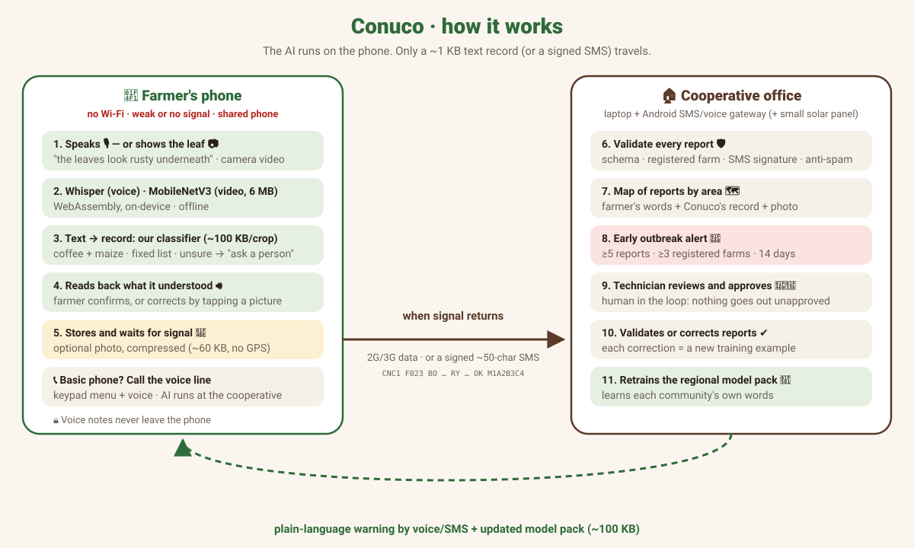

# 🌱 Conuco — a voice field notebook that works offline, on the farmer's phone

**Hack-Nation 7th Global AI Hackathon · World Bank "Small AI for Development" · Track B: Agriculture**

🔗 **Live demo:** https://oryamx.github.io/conuco/ (farmer app) · https://oryamx.github.io/conuco/cooperativa.html (cooperative panel) · https://oryamx.github.io/conuco/llamada.html (voice line simulator for basic phones)

🛡️ **Security:** threat model + 21 automated attack tests, all passing → [SECURITY.md](SECURITY.md)

> *Conuco* is the Venezuelan word for a small family farm plot.

## The one decision Conuco helps Noor with
**"I'm seeing something wrong in my coffee or maize. What do I do today — and who needs to know?"**

**One loop:** Noor sees a problem → **tells or shows** it → hears **what to do today** → **her cooperative knows** → the technician acts. Everything in Conuco is a way into or out of this loop: voice, camera, SMS and the phone line are different doors to the *same* report; the panel and alerts are how the technician closes it.

The challenge asks for a Small AI that helps Noor *make, communicate or act on* one better agricultural decision. Conuco does all three for this decision:

| Challenge wording | In Conuco |
|---|---|
| **Identifying a crop problem** | *Show me the leaf*: Noor points the phone camera at a maize leaf; a small vision model (MobileNetV3, 6 MB) watches the video **on the phone, offline**, and says what it is compatible with (rust, northern leaf blight, gray leaf spot, healthy, or "not a maize leaf I know") |
| **Documenting a field observation** | Noor speaks in her own words; on-device AI turns it into a technical field record and reads it back for her to confirm |
| **Communicating** it | The record reaches her cooperative when signal returns (or as a signed SMS, or through the voice line from a basic phone) |
| **Accessing localized advice / acting on it** | Right after she confirms, the app shows and **says out loud "What you can do today"**: one safe, no-chemicals check for that problem, and when to call the technician |
| **Connecting evidence to an extension-service next step** | When several farms in one area report the same thing, the cooperative gets an early outbreak alert; a technician approves it and every farm in the area is warned. The officer knows where to go first |

Conuco does **not** diagnose or prescribe. The "today" advice is a fixed, reviewed list (no generated text), and it always says: *no chemicals without the technician*. In a real deployment, agronomists from each cooperative would validate that list.

## The problem
Meet **Noor**, the farmer in the World Bank brief: 2 hectares in the highlands, coffee on the upper slope and maize and beans below, a member of her coffee cooperative for eleven years. Her coffee yields have dropped and she cannot say why. The extension officer visits twice a year at best. There is no Wi-Fi at home; the household buys 3G bundles when needed; she uses her own phone for calls, messages and mobile money, while the smartphone is her daughter's; most of the day the phone stays at the house while she works on the slope.

When a pest or disease starts, Noor sees it first — but has no one to tell in time, no technical words for it, and **no record exists of what is happening in the field**. The brief names this gap directly: *"the binding constraint is the absence of a working farmer registry rather than the absence of an algorithm."* Noor is fictional; her constraints are not (the brief draws them from Solomon Islands, Côte d'Ivoire and The Gambia, and 2.6 billion people remain offline).

| Noor's constraint (from the brief) | What Conuco does |
|---|---|
| The phone stays at the house most of the day | She records a voice note when she gets home; it waits for signal |
| No Wi-Fi, 3G bundles bought when needed | Only a ~1 KB text record travels — or a ~50-character SMS |
| Her own phone is for calls and messages; the smartphone is her daughter's | A voice line she can call from her own phone; the app on the shared smartphone |
| She speaks her local language | She talks in her own words, by voice (prototype: Spanish) |
| The extension officer comes twice a year | Early outbreak alerts tell the officer where to go first |
| Coffee above, maize and beans below | Coffee and maize model packs (beans next) |
| No working farmer registry | Every report builds the cooperative's registry |

**Where we localized it:** we built and tested the prototype in Spanish for coffee and maize smallholders in Venezuela, where the team is from. Nothing in Conuco is specific to Venezuela: a new region needs a voice model that speaks its language and a ~100 KB model pack trained on its farmers' words.

## The solution
Everyone builds AI that **talks to** farmers. Conuco is AI that **listens to** them — and turns what they already know into data a technician can act on.

1. The farmer **speaks in their own words** (or, for maize, **shows the leaf** to the camera): *"las hojas están como oxidadas por debajo y se están cayendo"* ("the leaves look rusty underneath and are falling").
2. **On the phone, offline**, Whisper transcribes the voice note and a tiny classifier we trained turns it into a **technical field record** (crop, compatible symptom, plant part, extent, since when, weather).
3. Conuco **reads back what it understood, out loud**. The farmer confirms, or corrects by tapping a picture.
4. Once she confirms, Conuco tells her **"what you can do today"**: one safe check for that problem (e.g. *"turn over leaves from several plants and count how many have orange powder underneath"*) and when to call the technician — never a chemical.
5. The record is stored on the phone and **sent automatically when signal returns** — or as a ~50-character SMS.
6. The cooperative sees a **map** and gets an **early outbreak alert** when several farms in one area report the same thing.
7. A **technician or cooperative promoter reviews and approves** the alert, which goes back to every farm in the area in plain language (voice/SMS).

Conuco **does not diagnose or prescribe**. It records what the person sees and tells a person. When it is not sure, it says so.

## 📷 Show me the leaf — the same report, by camera (maize)
Down in her maize, Noor can **show** the problem instead of describing it. She points the camera at a leaf, or picks a video or photo she recorded on the slope. Conuco looks at the video frame by frame, on the phone, and only answers when several frames agree. The result goes into **the same report and the same next step** as a voice note.

| | |
|---|---|
| Model | **MobileNetV3-small** fine-tuned for maize leaves · **1.5 M parameters · 6 MB ONNX** (`maiz_hojas.onnx`) · ImageNet weights from timm (Apache-2.0) |
| Runs on | The phone, in the browser: ONNX Runtime Web (WebAssembly) in a Web Worker. It is the same runtime as Whisper, so the only extra download is the 6 MB model. Works in airplane mode once cached |
| Video logic | ~3 frames per second, center crop 224×224, average of the last 8 frames. It answers only when the same class wins ≥75% of the frames and the average is ≥50%. Otherwise it says *"move closer or find better light"* |
| Speed | **13 ms per frame** in the browser (headless Chromium, 2-core CPU, not a phone); a stable answer in ~4 s |
| Classes | common rust · northern leaf blight · gray leaf spot · healthy · *other* (leaves of other crops) |
| Training data | From the brief's dataset list: **PlantDoc** (field/internet photos, CC BY 4.0) + **PlantVillage** (lab photos) · 1,460 training images · 14 epochs on CPU, ~10 min · label smoothing so it is less over-confident |
| Output | Never a diagnosis: *"compatible with…"*. The frame becomes the photo evidence of the report. Then the same flow as voice: confirm → *what you can do today* → cooperative → technician |

**Results on images the model never saw** (`modelo/vision/evaluacion_vision.json`):

| Test set | Result | 95% interval | Notes |
|---|---|---|---|
| PlantVillage, lab photos | **232 / 240 (96.7%)** | 94–98% | rust 60/60, healthy 60/60, gray spot 58/60, blight 54/60 |
| PlantDoc test, field photos of **diseased maize: exact disease name** | **17 / 26 (65%)** | 46–81% | rust 9/10, blight 7/12, gray spot 1/4 |
| …same 26 field photos: **sick leaf called "healthy"** | **0 / 26** | 0–13% | the error that matters most for a report |
| PlantDoc test, leaves of **other crops** → "other" | 32 / 33 | | |

Honest reading:
- **Small field sample** (26 maize photos), so the intervals are wide. Most errors are blight ↔ gray leaf spot, which both look like long spots. When both have weight, the app says *"blight or gray leaf spot, the technician will tell"* instead of choosing. Three of those "errors" are images whose own file name says *gray leaf spot* while PlantDoc labels them *blight*, a known label-noise issue.
- PlantDoc has **no healthy maize photos**, so "healthy" was learned only from lab photos. A healthy leaf photographed in the field may come out as *not sure*. The reports Conuco collects, each confirmed by a technician and with a photo, are exactly the field dataset this needs.
- The exported ONNX, with the browser's exact preprocessing, was evaluated directly (`modelo/vision/evaluar_vision.py`). It was also checked end-to-end in the browser: video, photo and live camera → record → *what you can do today* → cooperative (Playwright).

**Why this model.** A leaf held in front of the camera fills the frame, so **classification** (one label per frame) is enough: no box labels are needed, and it is the lightest option. We trained two small candidates on the same data and splits:

| | MobileNetV3-small ✅ | YOLO26n-cls (Ultralytics) |
|---|---|---|
| Lab photos | 96.7% | 95.8% |
| Field: exact maize disease | 17/26 | 16/26 |
| Field: sick called healthy | 0/26 | 0/26 |
| CPU time per image (ONNX) | 2.1 ms | 8.5 ms |
| License of the trained model | **Apache-2.0** | AGPL-3.0 |

Same accuracy or better, 4× faster, and a permissive license, so Conuco uses MobileNetV3. YOLO stays the right tool for the next step, which is *detection*: counting lesions on a leaf, or grading green coffee beans on a white sheet before selling (we reviewed *Gope et al., 2024, Scientific Reports*). A permissive detector such as YOLOX (Apache-2.0) or YOLOv9 (MIT) would keep the whole project open.

**Why maize first, and coffee next.** Noor grows maize below the coffee, and the maize datasets from the brief's list are on GitHub, which we could reach from our build environment. The coffee-leaf datasets (BRACOL, RoCoLe) are on Mendeley Data, which we could not download during the hackathon. The pipeline does not change: put one folder of photos per class and run `modelo/vision/preparar_datos.py` → `entrenar_vision.py`. Until then, a coffee report carries the farmer's photo for the technician.

## Same decision, any phone
These are not separate products: they are three doors to the same report, so Noor can use whichever phone is at hand.

| Channel | For whom | How |
|---|---|---|
| 📱 App (offline) | Farmers with a smartphone (even a shared one) | Voice → on-device AI → record → sent when signal returns |
| 📩 Signed SMS | Smartphone but no mobile data | The app produces a ~50-character SMS with an HMAC signature; the cooperative verifies it (forged, replayed or unregistered SMS are rejected) |
| 📞 Voice line | **Basic phones** (Noor's own phone) | Call the cooperative line → keypad menu → speak after the tone → AI runs on the cooperative's device → confirm with the keypad. If the AI doesn't understand, the farmer picks the problem with the keypad. *Prototype: browser simulator; connecting a real phone line (an Android gateway at the cooperative or a telephony provider) is the next step.* |

## Two crops, two tiny model packs
| Pack | Why | Categories (fixed list + "not sure") | Model size |
|---|---|---|---|
| ☕ Coffee | The World Bank brief's scenario; Venezuela's Andean smallholders | rust, berry borer, leaf miner, American leaf spot, brown eye spot, dieback, chewing insects (leaf-cutter ants), nutrition | ~130 KB |
| 🌽 Maize | The most critical crop for food security in Venezuela; grown on almost every *conuco* | fall armyworm, root pests (white grubs / Diabrotica), damaged ears, stored-grain weevil, drought stress, nutrition, leaf spots | ~105 KB |

The farmer picks what they grow when they register; if they name a crop in the sentence ("el maíz…"), Conuco switches pack automatically. Adding a crop = adding training phrases and running `python3 modelo/entrenar.py --cultivo <crop>`. Maize categories are deliberately conservative ("compatible with…, needs technician review").

## Why AI (and why a simpler tool would not do the job)
An SMS form needs literacy and technical vocabulary. A farmer can say *"los bachacos dejaron las matas peladitas"*; only speech recognition + language understanding can turn that into *"chewing-insect damage (leaf-cutter ants)"* — and do it offline, on a phone that is charged a few hours a day.

## Results with a real Venezuelan speaker (voice, on-device)
Gabi (team, Venezuelan) spoke 9 test phrases out loud into the live app (measured with the coffee model before the later updates; categories were added afterwards). The phrases were written by the team and were **not** used for training.

| Outcome | Count |
|---|---|
| Correct category | **8 / 9** |
| Wrong category with high confidence | **0** |
| "Not sure → ask a person" | 1 (speech recognition heard *"Dios"* instead of *"cogollos"*; the app refused to guess) |

**First real test, first failure, first lesson:** the very first thing Gabi said was *"las hojas están como comidas"* (leaves look eaten). The model had no category for chewing-insect damage, so it answered **"not sure"** instead of inventing. We added the category, retrained, and it now understands it. That is exactly how Conuco is meant to learn the language of each community.

**On a real phone (iPhone, Safari, airplane mode):** voice note → understood record in **~5 seconds**, fully offline (Whisper base). When signal came back, the queued report reached the cooperative in **1–2 seconds**. Not yet measured on a low-end Android; `?modelo=tiny` (~40 MB) is the fallback for weaker phones.

⚠️ Honest limits: all test phrases were written by the team, not by farmers; this measures the voice pipeline and phrasing variations, not real farmer vocabulary.

## Validation so far — and the pilot we need
**Honest status:** no farmer or extension officer has used Conuco yet. Training phrases and demo reports are synthetic; the camera model was trained on public datasets.

| What was tested with real people or real data | Result |
|---|---|
| A native Venezuelan Spanish speaker, 9 unscripted phrases, iPhone in airplane mode | 8/9 right category, 0 confident errors, ~5 s per voice note |
| The voice line (keypad + voice) | Report received and classified (*"manchas amarillas"* → maize leaf spots) |
| Camera model on public field photos it never saw | See *Show me the leaf* (small sample; numbers given with their limits) |

**The pilot that would answer the open questions** (one coffee cooperative, ~30 farms, 8 weeks):

| Question | How we would measure it |
|---|---|
| Do farmers use it, and in their own words? | Reports per farm per week; % of voice notes the model was *not sure* about; new words added to the pack |
| Are the records right? | % of reports the technician confirms without changes (target ≥ 80%) |
| Do alerts help the officer? | Days from first report to field visit, compared with the season before; false alerts per month |
| Is the "today" advice safe and useful? | Agronomist review of the list before the pilot; farmer feedback by voice after 2 weeks |
| Does the camera hold up in the field? | Accuracy on technician-labeled photos collected by the pilot itself |

Every report the technician confirms, with its voice transcript and photo, becomes labeled local data. That is exactly what the brief says is missing.

## Who uses it and who runs it
| Role | Tool | What they do |
|---|---|---|
| Farmer | Phone app (offline) | Speaks, confirms, optionally adds a photo, reports |
| Technician / cooperative promoter | Panel (`cooperativa.html`) | Reviews, validates or corrects reports; approves alerts |
| Regional coordinator (cooperative / federation) | `modelo/entrenar.py` | Retrains the regional model pack with validated phrases and publishes it |

The cooperative owns its data. Minimum infrastructure: a laptop or mini-PC at the office and an old Android phone as an SMS receiver (optional: small solar panel). Hosting cost is near zero because **all AI runs on the phone**; the website is only needed to install the app once (it could also be side-loaded from the promoter's laptop — not built yet).

## Architecture (everything runs in the browser)
| Piece | Technology | Where it runs |
|---|---|---|
| Voice → text | Whisper base/tiny (q8 quantized, ~80 / ~40 MB) via transformers.js + ONNX WebAssembly, in a Web Worker | Phone, offline |
| Text → field record | **Our own classifiers**, one per crop: character n-gram TF-IDF + logistic regression, **~130 KB coffee / ~105 KB maize** (`modelo_conuco.json`, `modelo_maiz.json`), fixed list of categories, confidence thresholds (≥70% sure, 45–70% "check", <45% "not sure → ask a person"); `lexicon.js` extracts plant part, extent, timing and weather and explains which words it recognized | Phone, offline |
| Speech recognition fixes | Small list of common mis-hearings of farm words (e.g. *"más ron"* → *"marrón"*), grows with real corrections | Phone |
| Read-back | Web Speech API (system voice) | Phone, offline |
| Leaf → possible disease | **MobileNetV3-small** (1.5 M params, 6 MB ONNX) on ONNX Runtime Web, frame voting over the camera video | Phone, offline |
| Photo (optional) | Compressed to 640 px JPEG (~40–80 KB) as **evidence for the technician**. For maize leaves, the camera model above adds a *"compatible with…"* hint; the technician confirms | Phone → cooperative |
| Offline app | Service Worker + Cache Storage | Phone |
| Delayed sending | Local queue (store-and-forward) + SMS code | Phone |
| Panel & alerts | Leaflet map + outbreak rule (≥5 reports, ≥3 farms, 14 days, same area and symptom) | Cooperative office |

In this prototype the "cooperative" is the panel on the same site (shared browser storage). In production, sending would go to the cooperative's server or an SMS gateway — not built yet.

## Conuco learns from use (how it adapts to other regions and slang)
1. The farmer corrects by tapping a picture, or the technician validates/corrects the report in the panel.
2. The panel counts validated phrases and lets you download them (`frases_validadas.txt`).
3. `python3 modelo/entrenar.py --entrenar-con frases_validadas.txt` retrains the model with the area's real vocabulary.
4. The new model (~130 KB) is pushed to phones when there is signal.

A model pack per region or language is ~130 KB — small enough to send over a weak connection. Whisper already covers Spanish accents across Latin America and ~99 languages; low-resource languages (e.g. Quechua, Wayuunaiki) would need Common Voice / MMS data.

## Data
- `reportes_sinteticos.json` / `generar_sinteticos.py`: **synthetic** demo reports (coffee in the Andes, maize in Portuguesa), labeled as such in the UI.
- Maize pests context: AgroDigital Venezuela (MINCYT), *Principales plagas*: fall armyworm, white grubs, Diabrotica, maize weevil.
- Vision: PlantDoc (github.com/pratikkayal/PlantDoc-Dataset, CC BY 4.0) and PlantVillage (github.com/spMohanty/PlantVillage-Dataset), maize classes. Scripts: `modelo/vision/preparar_datos.py`, `entrenar_vision.py`, `evaluar_vision.py`.
- `modelo/frases.py`: **synthetic** training phrases written by the team (≈2,400 coffee + ≈2,100 maize generated examples). To be replaced/extended with real reports confirmed by technicians.
- The farmer vocabulary is a **hackathon draft**: it must be validated with coffee farmers and agronomists in each area.
- Challenge context: World Bank "Small AI for Development" brief, Track B (Noor scenario).

## What it does not cover (yet)
- No real farmer data yet; vocabulary and reports are test data.
- The vision model covers **maize leaves only**, and its "healthy" class comes from lab photos (see *Show me the leaf*). Coffee leaves (BRACOL, RoCoLe) and beans (iBean) are next. Their datasets could not be downloaded from our build environment tonight.
- The voice line for basic phones is a **simulator**: the real telephony connection is not built yet.
- No backend yet (see SECURITY.md for the full list of limitations).
- Similar systems exist (e.g. FAO's FAMEWS for fall armyworm). Conuco's difference is *how* reports are made: by voice, in the farmer's own words, fully offline.

## Responsible by design
- A person always has the last word (the farmer confirms; the technician approves alerts).
- Only registered farms count toward alerts; signed SMS; anti-spam caps; strict validation; CSP. See [SECURITY.md](SECURITY.md).
- Fixed list of answers: it cannot invent diagnoses or prescribe agrochemicals.
- Voice notes **never leave the phone**; only the text record travels, without the farmer's name and with consent.

## Language note
The app's interface is in **Spanish on purpose**: it is built for Spanish-speaking farmers (the brief requires a local language). Code comments are in Spanish too. Everything judges need — this README, [SECURITY.md](SECURITY.md) and the videos — is in English. Key UI words: *Toca para hablar* = tap to speak · *Lo que entendí* = what I understood · *Sí, así es* = yes, that's right · *Sin señal* = no signal · *Panel de la cooperativa* = cooperative panel · *Línea de voz* = voice line.

## Run it locally
Any static server works: `python3 -m http.server` and open `http://localhost:8000`. The first load downloads the speech model; after that it works in airplane mode. `?modelo=tiny` uses Whisper tiny for low-end phones.

---
### 🇻🇪 Resumen en español
Conuco es un cuaderno de campo por voz para agricultores sin internet. El agricultor habla con sus palabras, la IA en el teléfono lo convierte en una ficha técnica, se lo repite para confirmar, le dice qué puede hacer hoy (sin químicos) y lo envía cuando vuelve la señal. La cooperativa ve un mapa, recibe alertas tempranas de brotes y un técnico decide qué avisar. Cada corrección enseña al modelo la forma de hablar de cada comunidad.
